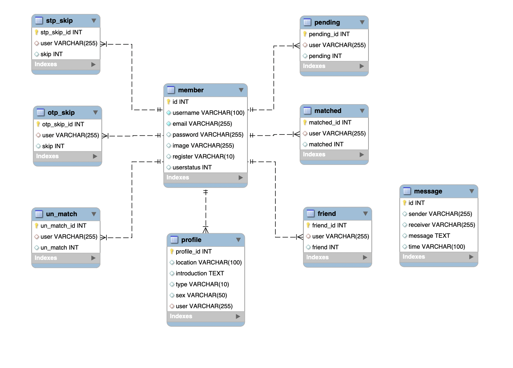

# Between

  
  <h4>Between helps you find someone that matches your personality.</h4>
  <h5>We use MBTI to feature yourself and your future friends.</h5>

## Demo

  <h4>Website URL : https://between.website/<h4>
  <h4>Test account</h4>
  <ul>
    <li>Email: lola@gmail.com</li>
    <li>Password: lola</li>
  </ul>  

    
## Main Features
#### Login
- Use 

#### Select MBIT type
- 
    
    
#### Match
- 

    
#### Chat
- 
      

## System Architecture
    
## Database Schema

    
## Backend Technique
#### Deployment
- Docker

#### Environment
- Node.js/Express.js

#### Database
- MySQL

#### Cloud Service (AWS)
- EC2
- S3, CloudFront
- RDS
- ElastiCache
- Route 53

#### Networking
- HTTP & HTTPS
- Domain Name System
- NGINX
- SSL

#### Version Control
- Git/GitHub

#### Third Party Library 
- passport
- bcrypt
- multer

## Front-End Technique
- HTML
- CSS
- JavaScript
- AJAX
